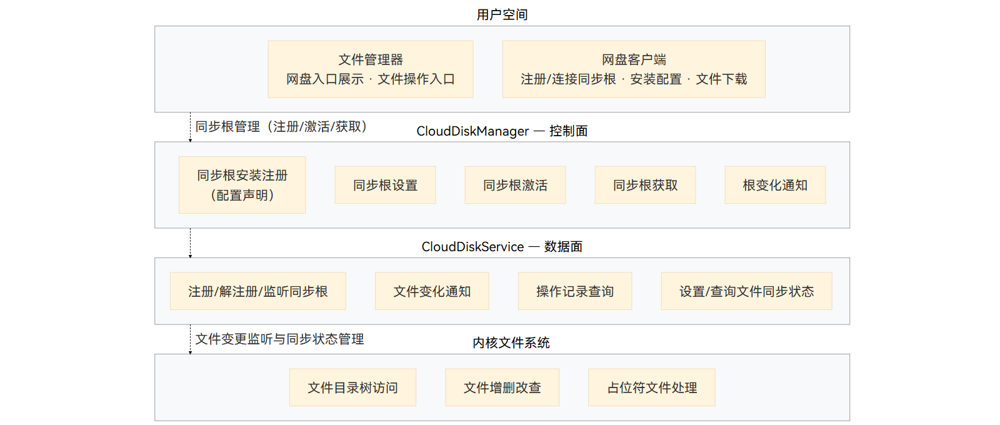

# 网盘服务底座概述
<!--Kit: Core File Kit-->
<!--Subsystem: FileManagement-->
<!--Owner: @lcm_kiku-->
<!--Designer: @wangyanyue-->
<!--Tester: @zsyztt-->
<!--Adviser: @jinqiuheng-->

网盘服务底座为网盘接入方应用提供云端文件在本地文件系统中的映射能力。应用将网盘目录注册为同步根后，即可通过网盘服务底座的开放API（[oh_cloud_disk_manager.h](../reference/apis-core-file-kit/capi-oh-cloud-disk-manager-h.md)）将云端文件以占位符文件形式映射到本地，本地仅保留文件名、逻辑大小、修改时间等元数据，真实内容按需下载。

作为系统级平台能力，网盘服务底座提供同步根管理、文件变更监听与同步状态管理、占位符文件生命周期管理、按需水合/脱水等能力，帮助网盘接入方应用快速接入文件管理器，同时保障用户侧体验的一致性及数据的可靠性。

## 能力范围

- 同步根接入与文件管理器集成：支持网盘接入方应用注册/解注册、激活/停用同步根，注册成功后文件管理器侧边栏展示网盘入口，用户可直接浏览、访问云端文件。
  - 注册即展示：应用将网盘目录注册为同步根后，文件管理器自动展示网盘入口，用户无需额外配置。
  - 生命周期管理：支持同步根的注册、解注册、激活、停用，以及同步根列表查询和自定义别名更新。
  - 批量清理：解注册同步根时自动批量清理同步根下的占位符文件，普通文件保留。
- 变更通知与历史操作查询：感知同步根下文件的变化，支撑网盘接入方应用完成文件同步。
  - 变更通知：注册同步根文件变更监听后，同步根下文件增删改通过回调实时通知网盘接入方应用。
  - 历史查询：支持增量查询同步根下文件的历史操作记录。
  - 文件同步状态管理：支持应用设置与查询同步根下文件的同步状态。
- 占位符文件机制：云端文件以占位符形式映射到本地，本地仅保留元数据、不落盘实体数据，实现大容量网盘在端侧的轻量呈现。
  - 创建占位符：应用注册同步根后，可在同步根下创建占位符文件映射云端文件，并设置创建时间、修改时间等元数据，不占用实际磁盘空间。
  - 文件识别：提供接口识别占位符文件与普通文件，占位符文件具备受保护的私有标记，普通进程无法伪造。
  - 修改与转换：支持占位符文件重命名、移动、删除，支持将占位符文件转换为0字节普通文件。
- 按需水合与脱水：云端文件实体按需上下行，避免全量下载占用本地空间。
  - 水合：将占位符文件按需下载为普通文件，支持取消水合。
  - 脱水：将水合完成的文件回退为未水合的文件，释放本地数据块，文件内容仍可在云端保留。

## 适用场景

- 用户场景
  - 管理网盘文件。
  - 按需访问云端文件。
- 应用场景
  - 网盘接入方应用接入文件管理器。
  - 云端文件本地映射与按需下载。
  - 云端文件变更感知与同步。
  - 端侧存储空间释放与管理。

## 基本概念

- CloudDiskService：网盘服务底座进程，负责文件变更通知、占位符生命周期管理、文件水合与脱水。
- 同步根：网盘接入方应用注册的网盘目录在本地文件系统中的根目录，是云端文件本地映射的边界；同步根内的文件变化由系统统一监听和记录。应用将网盘目录注册为同步根后，该目录以网盘入口的形式出现在系统文件管理器侧边栏。
- 占位符文件：本地映射云端真实文件的特殊文件，具备占位符标记拓展属性。本地保留文件名、逻辑大小、修改时间等元数据，但真实内容可以暂不落盘，以稀疏文件形态存在。
- 普通文件：不具备占位符标记、按普通文件系统语义读写的文件。
- 水合：将占位符文件对应云端数据下载到本地的过程，占位符状态由未水合推进到部分水合、完全水合。
- 脱水：释放文件本地数据块的过程，逻辑大小与修改时间等元数据保留。

## 实现原理

针对网盘接入方应用开发者，网盘服务底座提供同步根管理、占位符文件操作、按需水合/脱水等核心能力接口。应用将网盘目录注册为同步根后，即可通过调用 [oh_cloud_disk_manager.h](../reference/apis-core-file-kit/capi-oh-cloud-disk-manager-h.md) 里的API在同步根下创建占位符文件、判断占位符状态、更新元数据、响应水合/脱水回调，其余文件操作（打开、读取、重命名、删除等）沿用标准文件访问接口，由系统在后台完成占位符语义保护与同步编排。

网盘服务底座能力基于系统级服务构建。整体分层如下：

- **用户空间**：文件管理器与网盘接入方客户端位于最上层。文件管理器提供网盘入口展示与文件操作入口；网盘接入方客户端负责注册同步根、连接同步根、安装配置与文件下载。
- **CloudDiskManager（控制面）**：负责同步根的安装注册（配置声明）、同步根设置、同步根激活、同步根获取与根变化通知等控制面逻辑。
- **CloudDiskService（数据面）**：负责注册/解注册/监听同步根、文件变化通知、操作记录查询、设置/查询文件同步状态等数据面逻辑。
- **内核文件系统**：负责文件目录树访问、文件增删改查与占位符文件处理，为占位符文件提供受保护的文件系统语义。

